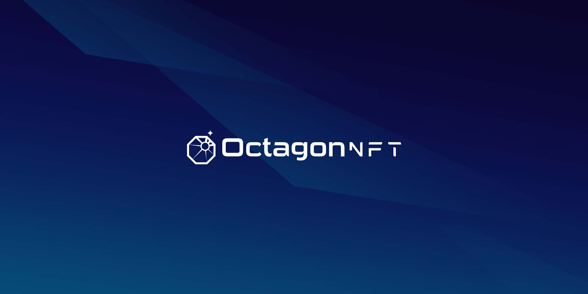

[Octagon NFT](https://www.nft.octagon.mn/).

Simply add Markdown files (or folders) to the `blog` directory.

Regular blog authors can be added to `authors.yml`.

The blog post date can be extracted from filenames, such as:

- `assadasd`
- `adadasdadasd`

A blog post folder can be convenient to co-locate blog post images:

**And if you don't want a blog**: just delete this directory, and use `blog: false` in your Docusaurus config.
