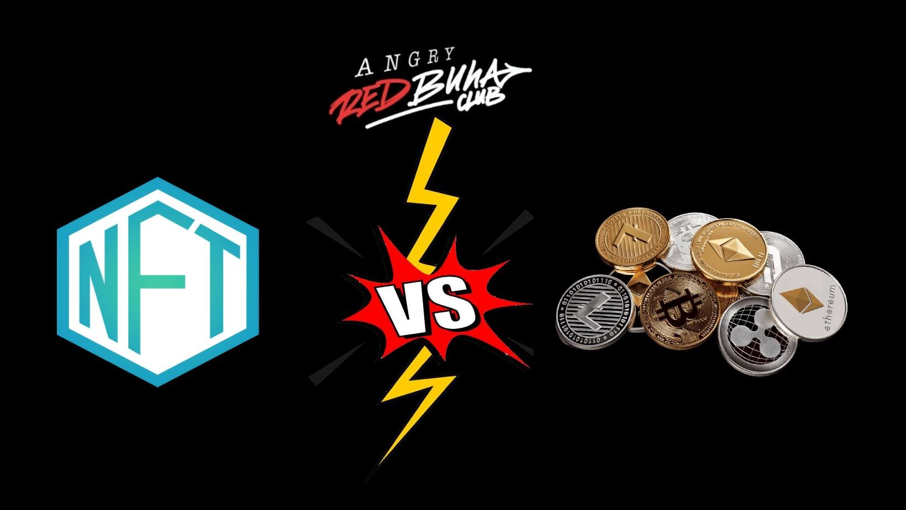

Крипто буюу Дижитал хөрөнгө гэх ойлголт нь технологийн тусламжтайгаар дижитал орчинд худалдан авч, хадгалж, шилжүүлж, арилжаалж болох мөнгө, түүнийг даган өсөх үнэ цэнэ, гэрээгээр баталгаажсан хэрэглээ юм. Нэг ёсондоо виртуал хөрөнгө нь бараа, үйлчилгээ худалдан авах эрх, хөдлөх ба үл хөдлөх хөрөнгийн эрх, үнэт цаас оролцсон гэрээний эрх болж чаддаг болсон гэсэн үг. Монгол улсын нийт мөнгөн дэвсгэртийн зөвхөн 7% нь л бидний гар дээр бэлнээр эргэлддэг бол үлдсэн 93% нь банкны дансны мэдээлэл дээр харагддаг баталгаат тоо юм. Дэлхий нийтээр сүүлийн 10-хан жилд дижитал хөрөнгө нь хууль эрх зүйн хүрээнд хэрэгжих хүртлээ бодит хэрэглээ болсон. Дэлхий нийтэд одоогийн байдлаар Эл Салвадор улс дижитал валютыг албан ёсоор төлбөрийн хэрэгсэл болгон зарласан байна. АНУ, Канад, Австрали, Сингапур зэрэг орнууд крипто валютын тал дээр эерэг байр суурьтай байдаг. Тодруулбал, АНУ болон Европын орнуудын олон зуун компани, үйлчилгээний газрууд биткойныг албан ёсны төлбөрийн хэрэгслээр хүлээн зөвшөөрч үйлчилгээ хийдэг. Тэр ч бүү хэл зарим компани цалингаа биткойноор тавьдаг болсон. Татварыг хүртэл төлөх боломж нээгдээд байна.

Дижитал хөрөнгийг 4 ангилдаг. Үүнд:

1. Бараа, үйлчилгээнд төлбөр хэлбэрээр тухайн хүн эзэмшдэггүй буюу хэн ч эзэмшиж болдог дижитал валют буюу **coin**
2. Бараа, үйлчилгээ авах эрх бүхий хэрэглээний **utility token**
3. Хөрөнгөжүүлсэн буюу үнэт цаасжуулсан **security token**
4. Ухаалаг гэрээгээр хэрэгждэг эзэмшигч нь тодорхой, дахин давтагдашгүй **NFT - non-fungible token**
  
    Ингэж ангилснаар бүх төрлийн зохицуулалтыг хийх боломж бүрддэг. Тэгэхээр Coin vs NFT-ийн талаар мэдээлэл хуваалцах нь зүйтэй юм.

### Bitcoin буюу хамгийн анхны крипто валют

2008 оны 11 сарын 1-ны өдөр Саташи Накамото гэх програмист ямар нэгэн гүйлгээ хийхдээ Засгийн Газар цаашлаад дундын ямар нэгэн дамжлагагүйгээр их хэмжээний шимтгэл төлөхгүйгээр мөнгөн тэмдэгт бүтээх үүднээс загвар болон эх кодыг нь бичин гаргасан хамгийн анхны цахим мөнгөний валют юм. Биткойны бас нэг том давуу тал бол улс хооронд хийдэг маш удаан хүлээгддэг гүйлгээг ганцхан цаг, түүнээс ч богино хугацаанд шилжүүлэх боломжийг бүрдүүлсэн явдал.

2009 оны 10 сард хамгийн анхны биткойн солилцоо явагдах үед 1 ам.доллар 1309 бүхэлтэй тэнцэж байсан. Гэтэл өнөөдөр 1 бүхэл Bitcoin 47,000 ам.доллар буюу 135 сая төгрөг орчим ханш хүртлээ өссөн нь хамгийн олон зах зээлийн үнэлгээтэй цахим мөнгө болж чаджээ.

Та өөрийн дансанд байгаа мөнгөөр гүйлгээ хийдэг, төстэй зарчмаар төлбөр болон гүйлгээ хийх боломж дижитал зах зээл дээр бүрдсэн. Гэхдээ дундын банк, зуучлагчгүйгээр нөгөө хүндээ мөнгө шууд дамжуулна гэсэн үг.

### NFT буюу цор ганц дүр төрх

2017 онд анх яригдаж эхэлсэн NFT дэлхийн нийтийн чиг хандлага болоод ямар ч үл хөдлөх хөрөнгө, ямар ч ховор урлагийн бүтээлээс илүү үнэтэй болсны гол учир нь таны эзэмшсэн NFT бүр өөрийн гэсэн гэрчилгээтэй ухаалаг гэрээгээр хэрэгждэг өөр хэн нэгэн хуулбарлах болон халдах боломжгүй баталгаат дижитал хөрөнгө юм. Өнгөрсөн оны хоёрдугаар сард дижитал зураг 69.3 сая ам.долларын үнэтэйгээр зарагдаж дэлхий нийт энэ салбарт хүссэн, хүсээгүй итгэл хүлээлгэж эхэлсэн.

Яг энэ үеэс эхлэн хүч түрэн давалгаалсан энэ салбарт өнөөдөр зөвхөн 1 худалдааны зах дээр гэхэд л 800 тэрбум ам.долларын хөрөнгө эргэлдэж байна. Хүмүүс өөрийн дүр төрхийг бүтээж түүнийгээ өмчилж бас борлуулж байна. Ижил сонирхол, даган дуурайх хүслээрээ нэгдэж танилын хүрээллээ тэлж байна. Түүгээр  ч зогсохгүй цахим тоглоомын ертөнцөд тэсрэлт хийж гарч ирсээр байна. Бидний мэддэг үл хөдлөх хөрөнгө, тансаг зэрэглэлийн орон сууц, автомашин гэдэг ойлголт хоёрдугаарт шилжиж дижитал зах зээл дээр NFT гэх цоо шинэ хэлбэрийн хөрөнгө бодитоор бас найдвартай эргэх болсон. Үүнийг дэлхийн хамгийн үнэтэй зарагдсан эхний 10 NFT-ээс харж болно. Дэлхийн хөрөнгийн том акуулууд эхнээсээ өөрсдийгөө NFT-чин гэдгээ зарлаад эхэлсэн. Дэлхийн томоохон дуудлага худалдаанд NFT аль хэдийнээ оролцдог болжээ.

### Үнэ ба үнэ цэнэ

Биткойныг програм болон техник хангамж ашиглан маш бага зардлаар олборлодог, өөр хоорондоо шилжүүлэн эзэмшиж болохуйц цахим мөнгө юм. Харин NFT бол хэзээ ч өөрчлөгдөхгүй ухаалаг автомат гэрээгээр баталгаажсан нэг тус бүр нь үнэтэй, түүнийгээ дагаад үнэ цэнэ нь өдөр бүр өсөн нэмэгдэж байдаг дахин давтагдашгүй бүтээгдсэн дижитал хөрөнгө юм. Таны хэтэвч бас хадгаламжийн данс хэдхэн жилийн дотор дижитал хэлбэрт шилжих нь тодорхой юм. Тэгвэл таны нийгэмд эзлэх байр суурь, хүрээллийг NFT зах зээл төлөөлж чаддаг болсон гэсэн үг. Таны нүүр номын зураг таны өөрийн NFT зураг болох нь цаг хугацааны асуудал юм.

### Mining vs Minting - Койн олборлох болон NFT нийлүүлэх

Биткойны олборлолт хязгаарлагдмал байхаар зохицуулагдсан. Цахим орчинд технологийн тусламжтайгаар койн олборлох нь хялбар бөгөөд хямд юм. Харьцуулж үзвэл, 1 их наяд төгрөгтэй тэнцэхүйц биткойн үүсгэх зардал ердөө 30 ам.доллар. Тэгвэл 10000 ширхэг “Unique” шинж чанар бүхий NFT-ийг зөвхөн нийлүүлэх зардал нь солана систем дээр гэхэд л валютаар төлөхөд 20000 ам.доллар болно. Яагаад гэвэл NFT-ийг бий болгоход тусгай уран бүтээлчийн санаа, дахин давдашгүй шинж чанар харагддаг.  NFT-ийг тусгай уран бүтээлч Artist яг л урлагийн бүтээл адилаар туурвидаг. NFT бүрийн ард програм мэддэг хэн нэгэн бус бүхэл бүтэн уран бүтээлч нэгдэл ажиллаж байдаг гэсэн үг. Таны гар дээр ирэх NFT бүр уран бүтээлээс ч илүү мэдрэмж, хөдөлмөр, шинэ санаа, технологийн өндөр дэвшлийг багтаасан цор ганц бүтээл юм.

### Smart Contract буюу Ухаалаг гэрээ

Бид үл хөдлөх хөрөнгийг гэрчилгээний хамтаар эзэмшдэг. Гэхдээ байгалийн болон давагдашгүй гамшигт хүчин зүйлээс хамаарч эсвэл хэн нэгэн эрх мэдэлтнээс хамаарч таны үл хөдлөх хөрөнгө устах, хууль бусаар худалдаалагдах, хураагдах зэрэг эрсдэл үүсэж болно. Харин NFT эзэмшихэд хэрэгжих ухаалаг гэрээ нь хэн ч үл өөрчлөх үл давтагдах цор ганц баталгаажсан код юм. Та дэлхийн хаанаас ч хүссэн хүнтэйгээ ухаалаг гэрээ байгуулах боломжтой. Шуудхан хэлэхэд ямар нэгэн эрх мэдэл бүхий улс төрч цаашлаад Засгийн газар хүртэл таны эзэшмлийн дижитал хөрөнгөд халдах эрхгүй гэсэн үг.

### Хэрэглээ ба Хүрээлэл

Койн болон NFT нь технологийн хувьд блокчейн систем дээр хэрэгжиж байгаа код хэдий ч хэрэглээний хувьд 2 өөр ойлголт юм. Койн худалдан авч цахим хэтэвч үүсгэж түүгээрээ бараа бүтээгдэхүүний төлбөрт төлж болно. Та худалдаж авсан койноо нөөцлөх, бусдад шилжүүлэх, төлбөр төлөх зэргээр санхүүгийн олон харилцаанд ашиглаж болно гэсэн үг. Харин NFT танд нэг төрлийн хүрээллийг үүсгэж санхүүгийн нэмэлт ашгаас гадна олон боломжуудыг санал болгодог. Таны эзэмшдэг NFT бүр дахин давтагдашгүй “Unique” шинж чанартай. NFT-ээр тусгай хүлээн авалт, урилга, эвент, урлагийн тоглолт, арга хэмжээ зэргийн тасалбарыг худалдан авах эрхтэй байдаг. Нэр төрийн баталгаа,  шинэ содон хүрээлэл, цуглуулга үүсгэж тухайн зах зээлээс цэвэр ашиг хүртэх зэрэг NFT-ийн хувьд бусад дижитал хөрөнгөөс эрс ялгаатай. Та энгийн нэг худалдан авагч, хадгалагч биш дижитал хөрөнгөө өсөн нэмэгдүүлэхэд шаардагдах олон сонирхолтой боломжийг эдэлдэг.

### Бодит байдал ба Боломж

Ганцхан жишээ дурьдвал, анх гарч ирэхдээ 1 ширхэг нь 300 мянган төгрөг байсан BAYC\Bored Apes Yacht Club\-ийн сармагчингийн өнөөдрийн хамгийн доод ханш гэхэд л энэ үнээс 500 дахин өссөн үнэлгээтэй байна. Дэлхий дээр хагас жилийн дотор ингэж өссөн үл хөдлөх хөрөнгө ч одоогоор үгүй билээ. Хүмүүс NFT-ийг зөвхөн худалдаж авахаас гадна клубын гишүүн болж олон талын давуу тал хүртэх болсон нь цор ганц эрхийг эдлэх боломж юм. NFT нь хүссэн хүрээлэл рүүгээ нэвтрэх тасалбар болдог байх нь.

Энийг уншиж байгаа танд ч бас яг тийм тасалбарыг олгож чадах ARBC\Angry Red Buha Club\ бэлэн болсныг дуулгахад таатай байна. Та давтагдашгүй бүтээгдсэн 10000 ширхэг ууртай бас ухаантай BUHA-аас эзэмшиж, цуглуулга үүсгэж, цаашлаад Octagon marketplace дээрх цэвэр ашгаас хувь хүртэх боломжтой юм. Таны эзэмшлийн BUHA өдрөөс өдөрт үнэ цэнээ өсгөж ирээдүйн санхүүгийн эрх чөлөөт NFT-чин болгож чадна гэдэгт огтхон ч эргэлзэхгүй байна. Солана систем дээр амьдрах чадвартай эдгээр BUHA бүр эзэндээ ээлтэй NFT нь байж чадах юм. Та ARBC-ын гишүүн болсноор танд цуглуулагч болоод Farming эрхэлж цэвэр ашиг хүртэх боломж олгоно. Таны эзэмшдэг NFT танд маш олон гайхалтай арга хэмжээний талалбар болно.
