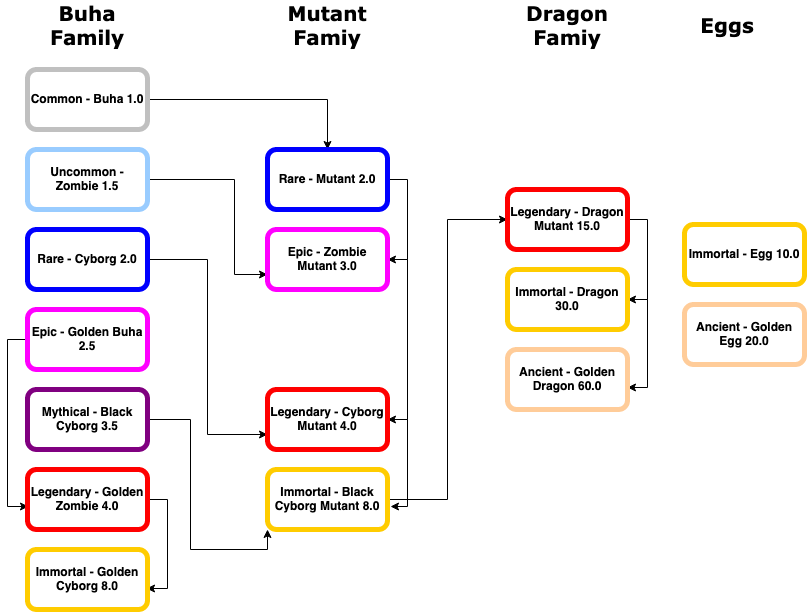

export const Highlight = ({children, color}) => (
  
    {children}
  
);

## Луугийн ферм эрхлэх нь...

Луугийн ферм нь таны **Buha** цуглуулагчийн түвшингээ ахиулахад чухал юм. Зарим **Buha**-ууд нээлттэй зарагдахгүй, зөвхөн **Airdrop**-оор тараагдах, эсвэл зөвхөн Лууны фермээр олж авахаас өөр аргагүй нөхцөл байдал танд тулгарч магадгүй. Octagon marketplace дээрээс худалдаж авч болох боловч, эзэмшигчид нь ямар үнэ ханшаар борлуулахыг таашгүй. Үндсэн хоёр тоглоомтойгоор эхэлж байна.

## Өндөг дарах тоглолт.

Бид **Buha**-аар хооллож Dragon болдог “Өндөг”-өөр тоглох фермийг танилцуулж байна.
Эхний ээлжинд 100 өндгийг нэг удаад 5 ширхэгээр нь [Дуудлага худалдаа](https://nft.octagon.mn/auction)-аар зарах бөгөөд та бусад тоглогчидтой үнэ хаялцаж авна.

Тоглогчид өндөгөө Buha NFT-ээр хооллож луу төрүүлэх зорилготой тоголно.
* Өндөгний дуудлага худалдаа нээгдэж тус бүрийн эхлэх үнэ **500,000₮**.
* Нэг өндөгний дуудлага худалдаа үргэлжлэх хугацаа 24 цаг.
* Өндөг дарах тоглолт [Buha.mn](https://www.buha.mn) сайт дээр хийгдэнэ. Та Octagon marketplace-ийн нэр нууц үгээр нэвтрэх боломжтой.
* Өндөгтэй тоглогчид хооллох 5 **Buha**-гаа сонгож өндөг дарах товчийг дарж эхэлнэ.
* Баталгаажуулж анхааруулах бөгөөд, өндөг дарахад сонгосон **Buha**-ууд устахыг анхаарна уу.
* Өндөг хооллох явц 14 хоног үргэлжилнэ.
* Өндөг дарах явц үргэлжилж байхад нэмж **Buha** оруулах боломжтой, энэ нь **Dragon** унах шансыг нэмэгдүүлнэ.
* Үндсэн 5 **Buha**-аас бусад шанс нэмэх **Buha**-уудыг өндөг дарж байх үед нэмэх боломжтой, шанс хэрхэн нэмэгдэж байгааг мөн харж болно.
* Өндөг дарахдаа хооллож буй **Buha**-ний BVP оноогоор Луутай болох боломжийн хувь нэмэгдэнэ.
  
| Rarity | Name | BVP | Юу гарах |
|:-:|:-:|:-:|:-:|
| <Highlight color="#ffcc00">Immortal</Highlight> | Egg | 10 | Dragon mutant эсвэл Dragon  |
| <Highlight color="#ffcc99">Ancient</Highlight> | Golden Egg | 20 |  Dragon mutant эсвэл Dragon эсвэл Golden Dragon |

:::info
Анхаарах зүйлс :

Өндөг дарахад зарцуулж байгаа BVP оноо бүр луу унах шансыг 0.5%-аар нэмнэ.
Бүх өндөгний хувьд 10 болон 20 BVP оноотой байгаа.
Хооллож байгаа Buha-уудын BVP-ууд бүгд нэмж тоологдоно.
Buha-аар feed хийх хамгийн дээд хэмжээ нь 50% хүргэх боломжтой.

:::

Хэрхэн тоглох тухай заавар бичлэг орууллаа.
<iframe width="675" height="380" src="https://www.youtube.com/embed/1R2oeheicLs" frameborder="0" allow="accelerometer; autoplay; encrypted-media; gyroscope; picture-in-picture" allowfullscreen></iframe>

## Fusion хийх тоглолт.

Fusion хийх тоглоом нь хэрэглэгчдэд өөрт байгаа ижил **Rarity**-тай хоёр **Buha**-г нийлүүлж нэг түвшин дээр **Rarity**-тай нэг **Buha** гаргаж авах боломжийг олгож байгаа юм.

* Fusion хийх тоглолт [Buha.mn](https://www.buha.mn) сайт дээр хийгдэнэ. 
* Өөрт байгаа **Buha**-уудаас 2 ижил **rarity**-тайг сонгож оруулаад **Fusion** товчийг дарна. Уг хоёр Buha устахыг анхаарна уу.
* Энэ үйлдлийг үргэлжлүүсэн тохиолдолд буцаах боломжгүйг анхааруулсан санамж гарч ирнэ.
* Fusion хийх үйлдэл гарч ирэх зорилгын BVP онооноотой тэнцүү хоног үргэлжилнэ.
* Та Fusion дууссаны дараа нэвтэрч орж, өөрийн fusion хийсэн **Buha**-гаа авах товчийг дарсанаар авах боломжтой.
  

**Buha гэр бүл**

| Rarity | Нэр | BVP |
|:-:|:-:|:-:|
| <Highlight color="#c0c0c0">Common</Highlight> | Buha | 1.0 |
| <Highlight color="#99ccff">Uncommon</Highlight> | Zombie Buha | 1.5 |
| <Highlight color="#0000ff">Rare</Highlight> | Cyborg Buha | 2.0 |
| <Highlight color="#ff00ff">Epic</Highlight> | Golden Buha | 2.5 |
| <Highlight color="#800080">Mythical</Highlight> | Black Cyborg Buha | 3.5 |
| <Highlight color="#ff0000">Legendary</Highlight> | Golden Zombie Buha | 4.0 |
| <Highlight color="#ffcc00">Immortal</Highlight> | Golden Cyborg Buha | 8.0 |

----

**Мутант гэр бүл**

| Rarity | Нэр | BVP |
|:-:|:-:|:-:|
| <Highlight color="#0000ff">Rare</Highlight> | Mutant | 2.0 |
| <Highlight color="#ff00ff">Epic</Highlight> | Epic Mutant | 3.0 |
| <Highlight color="#ff0000">Legendary</Highlight> | Cyborg Mutant | 4.0 |
| <Highlight color="#ffcc00">Immortal</Highlight> | Black Cyborg Mutant | 8.0 |

----

**Луу гэр бүл**

Лууг хоёр төрлийн тоглоомоор аль алингаар гаргаж авах боломжтой. Өөрөөр хэлбэл өндөг дараад луу гаргаж чадаагүй бол, Dragon mutant buha-аа fusion хийж луу үүсгэж болно. 

| Rarity | Нэр | BVP |
|:-:|:-:|:-:|
| <Highlight color="#ff0000">Legendary</Highlight> | Dragon Mutan Buha | 15.0 |
| <Highlight color="#ffcc00">Immortal</Highlight> | Dragon | 30.0 |
| <Highlight color="#ffcc99">Ancient</Highlight> | Golden Dragon | 60.0 |  

---

:::tip

Fusion хийх процесс Common Buha-аас эхлээд Golden Dragon хүртэл явах боломжтой.Энэ тоглоом одоогоор зөвхөн Angry Red Buha цувралд хүчинтэй.

:::

Хэрхэн тоглох тухай заавар бичлэг орууллаа.
<iframe width="675" height="380" src="https://www.youtube.com/embed/1T1diD9Gsxg" frameborder="0" allow="accelerometer; autoplay; encrypted-media; gyroscope; picture-in-picture" allowfullscreen></iframe>

## Стэйк хийх.

Энэхүү тоглоом нь  **Legendary**, **Titan** цуглуулагч нар өөрсдийн цуглуулгаараа ашиг хүртэх боломжийг олгох юм. Крипто сонирхдог, ашигладаг хэрэглэгчид маань Стэйк хийх тухай ойлголттой байдаг.